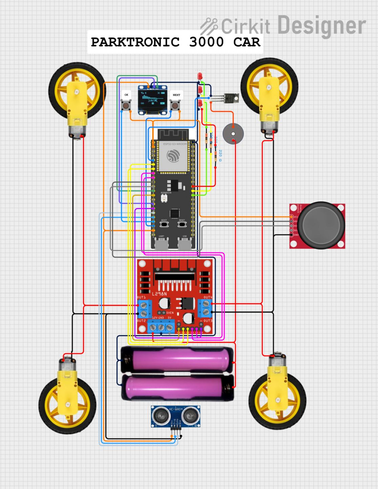
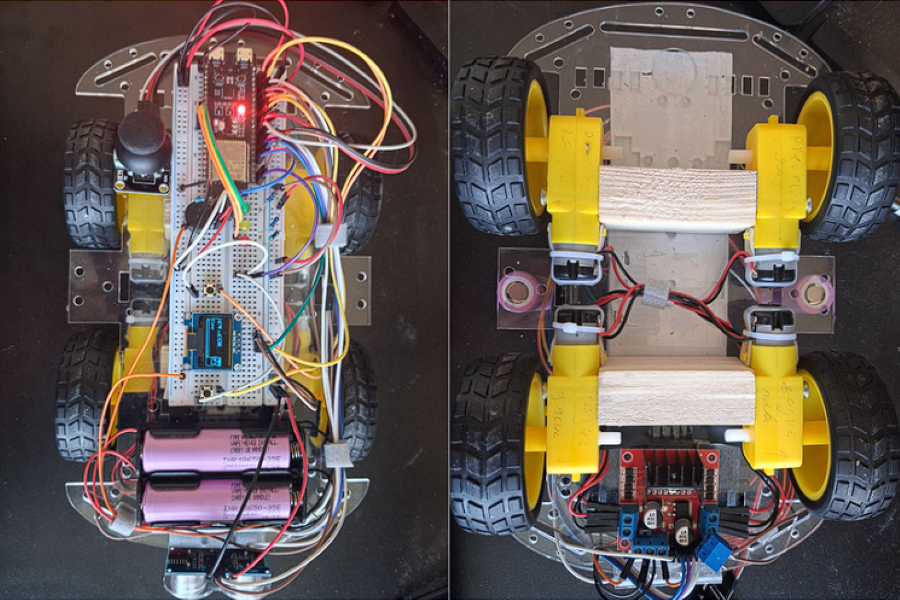

# Parktronik
> Car system improving safety parking

---

## Table of Contents
- [Introduction](#-introduction)
- [Features](#-features)
- [Hardware Schematics](#-schematic)
- [Tech Stack](#-tech-stack)
- [Future Improvements](#-future-improvements)
- [License](#-license)

---

## Introduction
 
**Parktronik** is an embedded system mounted on a car body that measures the distance to nearby walls or objects using an ultrasonic sensor. It provides real-time feedback through visual (LEDs + OLED display) and audio (buzzer) indicators, and allows the car to be driven manually via an analog joystick or remotely via Bluetooth.
 
The system features a small OLED display with two pages — a **Home** page showing live distance and status, and a **Settings** page where the user can configure the indication mode. Navigation between options is done using two physical buttons: **NEXT** and **OK**.

---

## Features

- **Ultrasonic distance sensing** — HC-SR04 measures the distance to the nearest obstacle in real time
- **4-zone proximity indication:**
  - `> 16 cm` — Clear (no indication)
  - `11–16 cm` — Approach (green LED, slow beep)
  - `5.5–11 cm` — Warning (yellow LED, medium beep)
  - `< 5.5 cm` — Stop (red LED, fast/continuous beep)
- **OLED display interface:**
  - **Home page** — displays live distance, status text, and a proximity fill bar
  - **Settings page** — four configurable indication modes
- **Indication modes (selectable via display):**
  - Light & Sound (LEDs and buzzer active simultaneously)
  - Light Only (visual indication only)
  - Sound Only (audible indication only)
  - None (distance and status shown on display only)
- **Special modes (selectable via display):**
  - **Autopilot** — monitors the rear of the vehicle and automatically halts movement upon detecting collision
  - **Parking Mode** — reduces drive speed to low, precise levels for tight manoeuvres.
- **2-button display navigation:**
  - `NEXT` — cycles through the available options on the current page
  - `OK` — confirms the highlighted option
- **Joystick control** — full directional control of the car via an analog joystick
- **Bluetooth control** — wireless control from a mobile device; automatically disables joystick input while connected
---

## Schematic

---

## The car

---

## Tech Stack

| Layer | Technology |
|-------|-----------|
| **Firmware** | C++ (Arduino framework), ESP32 S3 |
| **Sensors** | HC-SR04 |
| **Display** | SSD1306 OLED display |
| **Motors** | TT DC motors, L298N driver |
| **Frontend** | React Native (Expo) |
| **Build tools** | PlatformIO |

---

## Future Improvements
 
- Add a camera module (e.g. ESP32-CAM) for live video feed via Bluethooth
 
---

## License

This project is licensed under the MIT License — see the [LICENSE](LICENSE) file for details.
