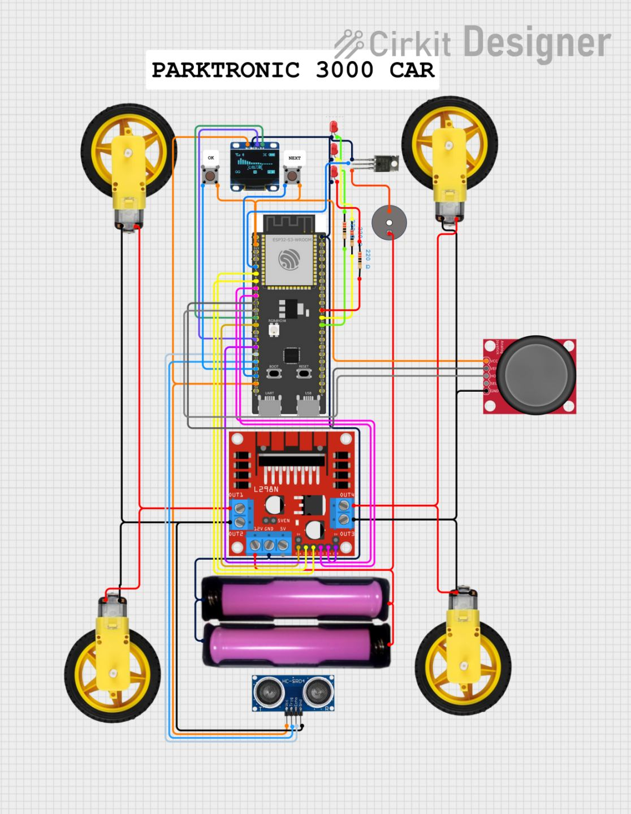

# Parktronik

---

## 📑 Table of Contents
- [Project Introduction](#-introduction)
- [Project Features](#-features)
- [API Documentation](#-api-documentation)
- [Hardware Schematics](#-schematic)
- [Tech Stack](#-tech-stack)
- [Installation Guide](#-installation-guide)
- [Usage](#-usage)
- [Future Improvements](#-future-improvements)
- [License](#-license)

---
## 🔌 Schematic

---

---

## 📄 License

This project is licensed under the MIT License — see the [LICENSE](LICENSE) file for details.
