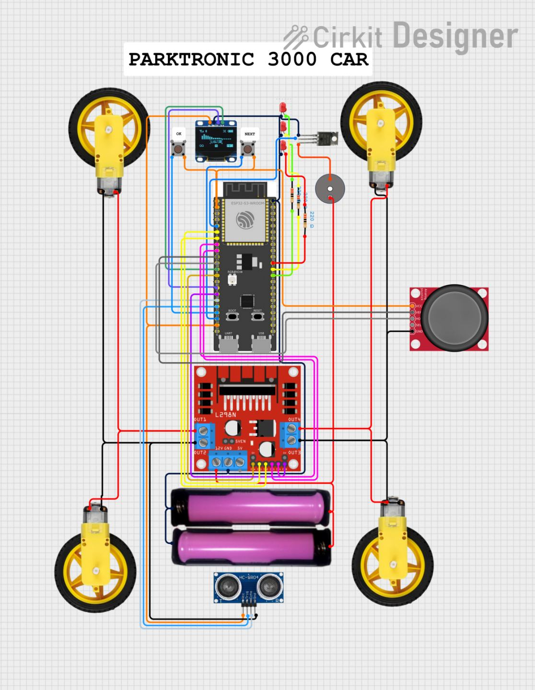
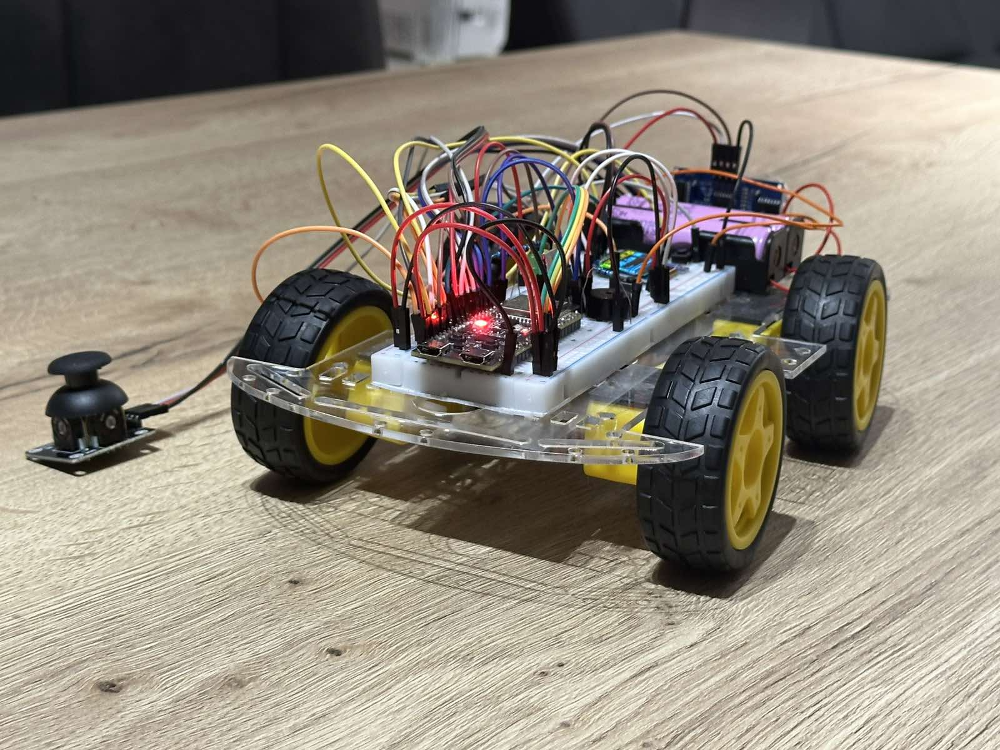
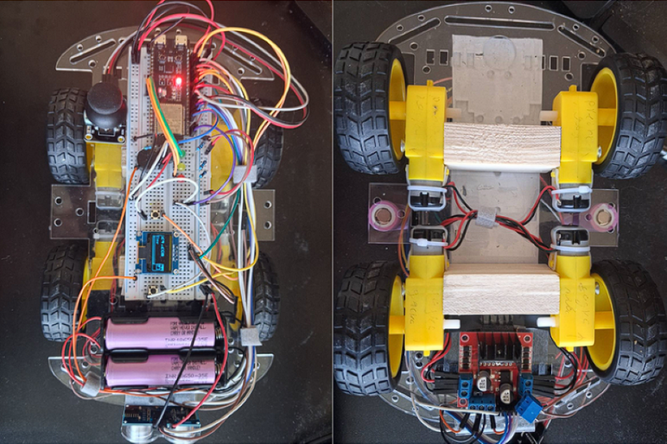
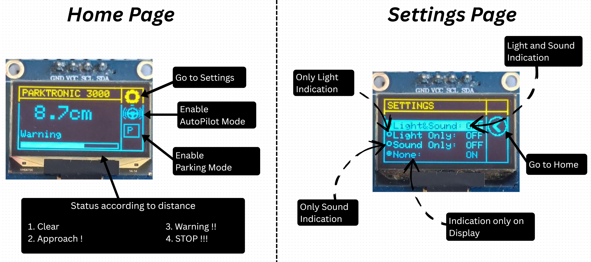
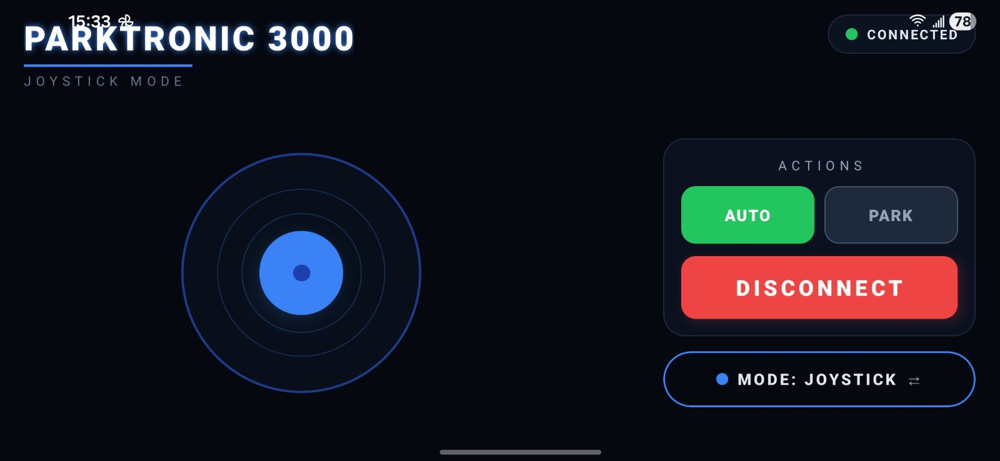

# Parktronik 3000

<!-- 

 -->

> Parktronik is an embedded parking assistant system mounted on a car body that measures the distance to nearby obstacles using an ultrasonic sensor. It provides real-time feedback through visual (LEDs + OLED display) and audio (buzzer) indicators, and allows the car to be driven manually via an analog joystick or remotely via Bluetooth.

---

## Table of Contents
- [Introduction](#introduction)
- [Features](#features)
- [Hardware Schematic](#schematic)
- [The Car](#the-car)
- [OLED Display](#oled-display)
- [Mobile App Control](#mobile-app-control)
- [Tech Stack](#tech-stack)
- [Future Improvements](#future-improvements)
- [License](#license)

---

## Introduction

Parking in tight spaces is one of the most common causes of minor vehicle damage. Parktronik 3000 addresses this by bringing a functional, low-cost parking assistant system to a custom-built car platform. The system continuously monitors the distance to nearby obstacles and translates that data into immediate, intuitive feedback — combining LED indicators, a buzzer, and a live OLED display so the driver always knows exactly how much clearance remains.

Beyond basic sensing, Parktronik supports both manual joystick control and wireless Bluetooth operation via a mobile app, as well as special modes like Autopilot (automatic stop on collision detection) and Parking Mode (reduced speed for precise manoeuvring).

---

## Features

* Ultrasonic Distance Sensing — HC-SR04 measures the distance to the nearest obstacle in real time.
* 4-Zone Proximity Indication — Progressive alert levels based on distance:
  * `> 16 cm` — Clear (no indication)
  * `11–16 cm` — Approach (green LED, slow beep)
  * `5.5–11 cm` — Warning (yellow LED, medium beep)
  * `< 5.5 cm` — Stop (red LED, fast/continuous beep)
* OLED Display Interface — Two-page UI for live feedback and configuration:
  * Home page — displays live distance, status text, and a proximity fill bar
  * Settings page — four configurable indication modes
* Indication Modes (selectable via display):
Light & Sound — LEDs and buzzer active simultaneously
Light Only — visual indication only
Sound Only — audible indication only
None — distance and status shown on display only
Special Modes (selectable via display):
Autopilot — monitors the rear of the vehicle and automatically halts movement upon detecting a collision
  * Parking Mode — reduces drive speed to low, precise levels for tight manoeuvres
* 2-Button Display Navigation:
`NEXT` — cycles through available options on the current page
`OK` — confirms the highlighted option
Joystick Control — full directional control of the car via an analog joystick.
Bluetooth Control — wireless control from a mobile device; automatically disables joystick input while connected.

---

## Schematic

---

## The Car

  
  

---

## OLED Display

---

## Mobile App Control

---

## Tech Stack

| Layer | Technology |
| :--- | :--- |
| Firmware | C++ (Arduino framework), ESP32 S3 |
| Sensors | HC-SR04 Ultrasonic |
| Display | SSD1306 OLED |
| Motors | TT DC motors, L298N driver |
| Frontend | React Native (Expo) |
| Build Tools | PlatformIO |

---

## Future Improvements

Add a camera module (e.g. ESP32-CAM) for live video feed via Bluetooth.


---

## License
This project is licensed under the MIT License. See the [LICENSE](LICENSE) file for details.